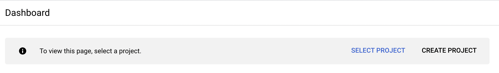
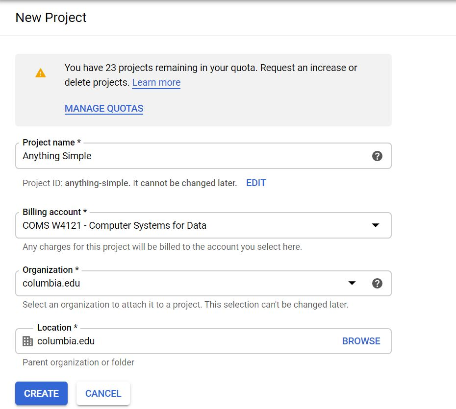
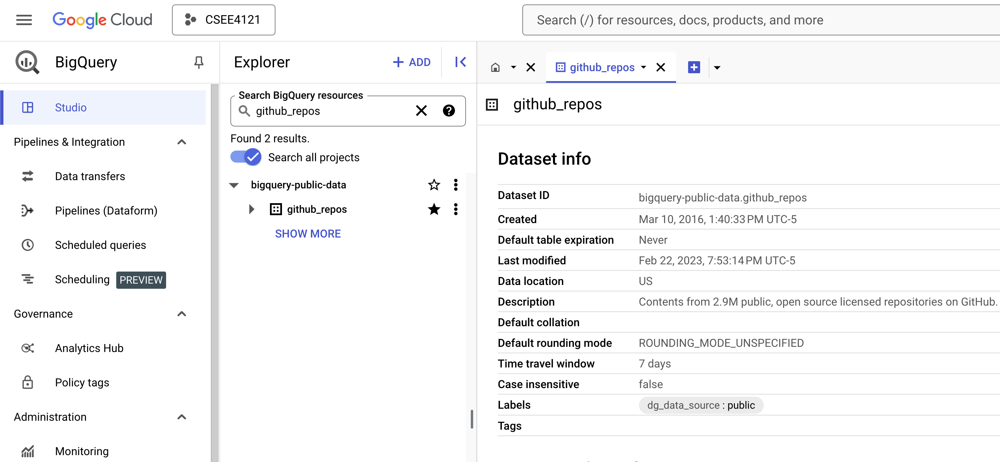
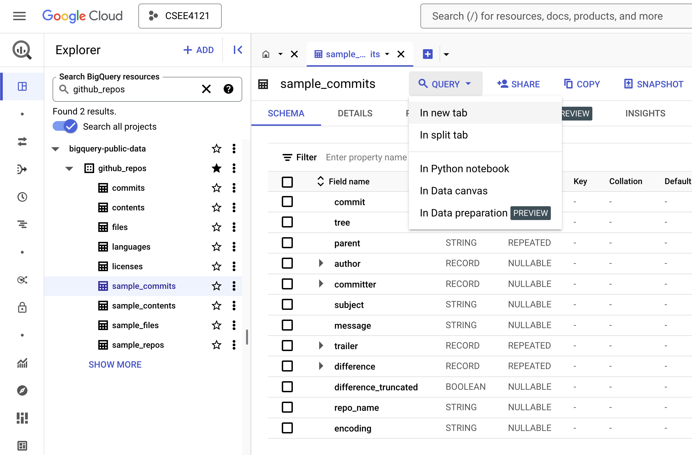
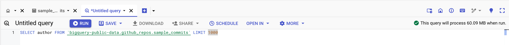

# Programming Homework 1: SQL 

Gain a hands-on understanding of Google BigQuery and SQL.

Due: **2/24/2026 (Tuesday), 11:59 PM Eastern**

## Overview

Welcome to CSEE 4121! This assignment will help you get familiar with the Google BigQuery platform and the SQL language. Google has published many datasets on BigQuery -- these range from Github statistics to real-time air quality data. In this first assignment, you will be using BigQuery’s SQL interface to answer questions about the Github Dataset.

## Learning Outcomes

After completing this programming assignment, students should be able to:

* Write SQL queries on the Google BigQuery platform.
* Use SQL to perform a preliminary analysis of any dataset.

## Getting Started

This section will guide you through creating a BigQuery project and setting up
your account so that you can query the Github dataset.

1. Make sure you have followed the [instructions](http://www.cs.columbia.edu/crf/cloud-cs/) provided by CRF to redeem your credits in Google Cloud.

1. Click this [link](https://console.cloud.google.com/projectselector2/home/dashboard). You’ll see the page below; click “Create Project” to make a GCP (Google Cloud
   Platform) project.

   

1. Fill in the information to make a new project. Make sure to select the new
   billing account you set up after redeeming the class GCP credits.

   

   If you mess this up and select the wrong billing account, please follow these
   [instructions](https://cloud.google.com/billing/docs/how-to/modify-project#to_change_the_projects_account_do_the_following)
   to change the billing account for your project to the billing account created
   in Step 1.

1. Go to BigQuery. Make sure to select the correct project in the dropdown menu on the top left.

   In the sidebar, you should see a search menu. Search for the `github_repos` dataset, pressing Enter, clicking "Search all projects", and pressing Enter again. Then you should be able to find the `github_repos` dataset. 

   Make sure to star it. This will allow you to quickly access it in the future.

   

1. Click on and expand the dataset. You should see 9 tables in the sidebar.
   Click on each table -- you should see the schema and descriptions of each
   table. 

   Although we will only be dealing with a subset of these tables, it is
   recommended to familiarize yourself with these tables before you jump into
   writing queries.

   The `sample_commits`, `sample_contents`, `sample_files` are subsets of the `commits`, `contents`, and `files` tables, respectively. We will **NOT** use the full `commits`, `contents`, and `files` tables as they are too large to process.

   This assignment is intended to test your ability to translate a question in
   plain English to a schema -- in other words, we want you to explore the data
   and think about which tables and columns are necessary in order to answer the
   questions. This is how real world data querying and analysis works!

1. Once you've selected a table, click on the `QUERY` dropdown menu and select
   `In new tab` to start a query on a table.

   

1. Once you type in your query, you should notice that the green validator on
   the top right corner of the editor. This estimates how much data will be
   processed when the query is run.

   **Note:** you will be billed by the number of bytes read by each query. Each
   month, only the __first 1TB read is free__, so be careful and try to avoid
   using `SELECT *`. You should only retrive the related columns. Each query should not need to consume more than 1GB.

   

1. In declarative languages, it’s easier to build up the query piece-by-piece.
   Start with a basic outline of what you’re looking for (for example, write a
   broad condition, or do a join). Then, add complexity to your query one bit at
   a time. It’s much easier to debug this way as well.

1. BigQuery can auto-format your SQL queries with <kbd>Ctrl-Shift-F</kbd> on
   Windows or <kbd>Cmd-Shift-F</kbd> on macOS (You may need to do some editing
   for it to take effect). This is a good way to learn about conventional SQL
   style guidelines and will also make your queries more readable, which we
   appreciate.

   __Note__: When querying in BigQuery, table names should be wrapped in
   backticks (`). For example, instead of writing:

   ```sql
   SELECT * FROM bigquery-public-data.github_repos.sample_commits
   ```

   write:

   ```sql
   SELECT * FROM `bigquery-public-data.github_repos.sample_commits`
   ```

## Helpful Resources

- [BigQuery SQL syntax](https://cloud.google.com/bigquery/docs/reference/standard-sql/query-syntax)
- [Using Cloud Console](https://cloud.google.com/bigquery/docs/quickstarts/query-public-dataset-console) (First section)

## Questions

**Please read the submission instructions carefully before starting the
assignment.**

Now that you’ve gotten comfortable with BigQuery and its SQL querying interface,
let’s get to work and answer some questions about the Github dataset!

You will be asked to submit a CSV file containing the results of your queries
for each question. You can download the results of a query using the
`SAVE RESULTS` button in the `Query results` panel and choose
`CSV (local file)`. We will provide the column names for the expected output.
Do not edit the file manually after downloading -- it may break our autograder.

**Notes:**

-  We will be using an autograder for grading this assignment. Hence, it is
   critical that you follow the ordering and other constraints as mentioned in
   the instructions. There is no partial credit for this assignment.
-  We will only be working with the following tables: `languages`, `licenses`,
   `sample_commits` and `sample_repos`. You should ignore all other tables that are
   present in the Github dataset, and use a **subset of the above
   mentioned tables only** to answer the questions below. Do **NOT** use the table `commits` to substitute the table `sample_commits`.
-  In general, the problems don't state which table you should look at. Instead,
   it's up to you to figure that out based on the context.
-  **CSV output should match exactly in ordering and in values.** Make sure to
   not modify it after downloading from GCP.


1. (1 point) List the names of the top 10 authors (*not* committers) with the highest number of commits. Order them by the highest number of commits (i.e., in descending order).

   Note that some authors use more than one names, and different authors might have the same name. To simplify the problem, please use the **combination of name and email** as the unique identifier for each author.

   | name | count |
   | :--: | :---: |
   |      |       |

1. (1 point) List the top 10 licenses with the most associated repos, in descending order by count.

   | license | count |
   | :-----: | :---: |
   |         |       |

1. (2 points) You might have noticed that some licenses belong to the same family (e.g., `gpl-2.0` and `gpl-3.0`). List the license families along with the number of associated repos, in descending order by count.

   We categorize the family of a license as follows. If the license contains:

   * `gpl` as a substring, it belongs to the `gpl` family
   * `bsd` as a substring, it belongs to the `bsd` family
   * `mit` as a substring, it belongs to the `mit` family
   * All the other licenses belong to the `other` family

   **NOTE: All strings above are case-sensitive.**

   **NOTE**: Only use `SELECT` statements. No `UPDATE` statements are necessary.
   You should use a series of `CASE ... WHEN` statements. No regexes are necessary.

   | family | count |
   | :----: | :---: |
   |        |       |

1. (1 point) We now focus on the programming languages used in Github repos. List the names of the top 10 languages used by most repos, in descending order by count. 

   As a repo might use multiple languages, count a repo for each language it uses.

   **HINT**: Use [UNNEST](https://cloud.google.com/bigquery/docs/nested-repeated#query_nested_and_repeated_columns) to expand repeated columns.

   | name | count |
   | :--: | :---: |
   |      |       |

1. (2 points) We can calculate how much a programming language is used in a repo by dividing the number of bytes used in this language by the total number of bytes used across all languages. List the name of each programming language along with the number of repos where it accounts for at least 50% of the total usage, in descending order by the repo count.

   Order by the repo count (descending), and then by language name (descending).

   **NOTE**: Having multiple ordering criteria serves as a tiebreaker mechanism, leading to deterministic output. The ordering criteria are listed in order of priority. That is, results should first be ordered by `count`, and then by `name`. **Make sure to follow this ordering priority!**

   **HINT**: Consider first adding a new column to represent the total number of bytes across all languages in a repo.

   | name | count |
   | :--: | :---: |
   |      |       |

1. (2 points) What is the most popular repo that uses a given programming language?

   List the name of each language along with the repo that has the higest watch count among the repos using this language, in descending order of the language name.

   For a repo that uses multiple languages, all these languages are considered regardless of the number of bytes.

   **HINT**: Use the [MAX_BY](https://cloud.google.com/bigquery/docs/reference/standard-sql/aggregate_functions#max_by) function.

   | name | repo_name |
   | :--: | :-------: |
   |      |           |


1. (2 points) Which programming languages are most common among the popular repos?

   Among the top 100 repos with highest watch counts, list the name of each programming language used in these 100 repos and its occurance among these 100 repos, in descending order of the occurance. 

   Order by the occurance (descending), and then by language name (descending).

   For a repo that uses multiple languages, all these languages are considered regardless of the number of bytes.

   | name | occurance |
   | :--: | :-------: |
   |      |           |

1. (2 points) List the name of each programming language with the repo_name of the repo that has most commits among the repos using this language.

   Order by the commit count of the repo with most commits (descending), and then by language name (descending).

   For a repo that uses multiple languages, all these languages are considered regardless of the number of bytes.

   | name | repo_name |
   | :--: | :-------: |
   |      |           |

1. (1 point) How does the number of commits change over time?

   List the number of commits that were committed in each year, sorted in descending order by year. Use the committer's date as the time a commit is considered committed.

   **HINT**: Use [EXTRACT](https://cloud.google.com/bigquery/docs/reference/standard-sql/date_functions#extract) to extract the year from a BigQuery timestamp.

   | year | count |
   | :--: | :---: |
   |      |       |

1. (1 point) Which weekday had the most commits committed? 

   List the day (using numbers 1-7) along with the total number of commits given that day. Use the committer's date as the time a commit is considered committed.

   Order by the number of commits (descending).

   **HINT**: The `DAYOFWEEK` function allows you to extract the weekday. Its range is 1-7 with 1 corresponding to Sunday. The values of the `day_num` column should be numerical.

   | day_num | count |
   | :-----: | :---: |
   |         |       |

   It’s not surprising that there are not many commits during weekends.

1. (2 points) Repositories are grouped into **commit activity buckets** based on their total number of commits:

   - **low**: fewer than 100 commits  
   - **medium**: 100–999 commits  
   - **high**: 1000 or more commits  

   For each activity bucket, compute:

   1. The **average watch count**
   2. The **median watch count**

   **Ordering**  
   Order the output by activity level severity:
   1. `high`
   2. `medium`
   3. `low`

   **Notes**
   - Commit counts should be computed using the `sample_commits` table.
   - Watch counts are obtained from the `sample_repos` table.
   - Median must be computed correctly using SQL-supported methods.
   - Your output **must include all three buckets** (`high`, `medium`, `low`) **even if a bucket contains zero repositories**.  
     If a bucket has no repositories, output `NULL` for both `avg_watch` and `median_watch`.

   **Output Format**

   | activity_level | avg_watch | median_watch |
   |:--------------:|:---------:|:------------:|


1. (2 point) Who authored the most commits, and which repos did they contribute to the most?

    List the top 10 authors (*not* committers) who authored most commits along with (1) the total number of commits they authored across all repos, and (2) the repo that they contributed the most.

    To simplify the problem, please use the combination of name and email as the unique identifier for authors.

    Order by the total number of commits they authored in all repos (descending).

    | author_name | commit_count | repo_name |
    | :---------: | :----------: | :-------: |
    |             |              |           |

1. (2 point) Git allows a committer to commit on behalf of an author. For example, when you create a pull request on GitHub to contribute to an open-source project, the maintainer can commit your changes on your behalf after approving them.

    For each repo, calculate the ratio of commits where the author is the same as the committer. This ratio is obtained by dividing the number of such commits by the total number of commits in the repo (i.e., a ratio of 1 means that the author is the committer for all commits). Round the ratio to **two decimal places**.

    To simplify the problem, please use the combination of name and email as the unique identifier for authors and committers.

    Order by `repo_name` (descending).

    **HINT**: Use the `ROUND` function for rounding the ratio to the appropriate number of decimal places.

    | repo_name | ratio |
    | :-------: | :---: |
    |           |       |

1. (2 points) For each repo, find the author who authored most commits, the committer who committed most commits, and the language that occupies the most bytes.

    To simplify the problem, please use the combination of name and email as the unique identifier for authors and committers.

    Order by `repo_name` (descending).

    | repo_name | author_name | committer_name | language |
    | :-------: | :---------: | :------------: | :------: |
    |           |             |                |          |

1. (2 points) For repos that use the `mit` licence and with at least `8000` watch count, find the main author who authored most commits.

    To simplify the problem, please use the combination of name and email as the unique identifier for authors.

    Order by `repo_name` (descending).

    | repo_name | license | watch_count | author_name |
    | :-------: | :-----: | :---------: | :---------: |
    |           |         |             |             |


This is the end of the assignment - great job!

## Submission Instructions

This is a __solo__ project. Every student should submit their own work.

### File Submission

Each student should submit one zip file to Gradescope.

1. Copy all your queries into `hw1_submission.py`. You can find the file
   on Courseworks. In order to be properly graded, the **file must be named
   `hw1_submission.py`**.

1. Rename your CSV outputs to `qN.csv`, where `N` is the question number. For
   example, question 10 would be `q10.csv`.

1. Please ensure that your directory structure is as shown below. The zip file
   that you submit should have all the csv results as well as
   `hw1_submission.py` **at the root**. When you compress your submission,
   you should select the individual files, rather than the directory containing
   them.

   **If these files are present in any other folder inside the zip file, then the
   autograder will fail, yielding no points.**

Zip file structure:

```
UNI_assignment1.zip
├── hw1_submission.py
├── q1.csv
├── q2.csv
├── q3.csv
├── q4.csv
├── q5.csv
├── q6.csv
├── q7.csv
├── q8.csv
├── q9.csv
├── q10.csv
├── q11.csv
├── q12.csv
├── q13.csv
├── q14.csv
└── q15.csv
```

### Notes:

When you submit to Gradescope, we will automatically check the following:

-  Your SQL query syntax.
-  The file structure of your submission (whether all the files follow the
   naming convention).
-  That all files are present.

This should run immediately and return whether the query ran OK or if there were
errors - **please make sure that you get a positive result from this test in your
final submission.**

**Handling Ties**: You may have noticed that in case of ties (between two
records of the ordering column), BigQuery may produce either of the orderings.
Make sure to follow the tiebreaker criteria specified in each part. You will
recieve no credit for incorrect output due to mishandled ties.

You will not see a final grade until after the project deadline. It is your
responsibility to ensure that your final submission is free of Python or SQL
syntax errors and that you follow all instructions in this section. We reserve
the right to deduct points from your project if you do not follow the submission
instructions, or if you have syntax errors in your queries.

The autograder automatically checks for cheating. Students that are caught
cheating will receive a 0.
