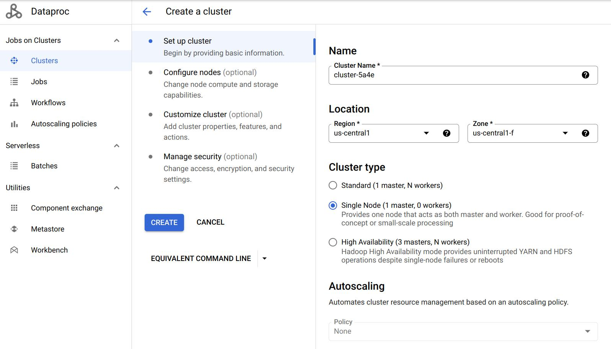
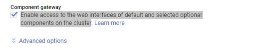
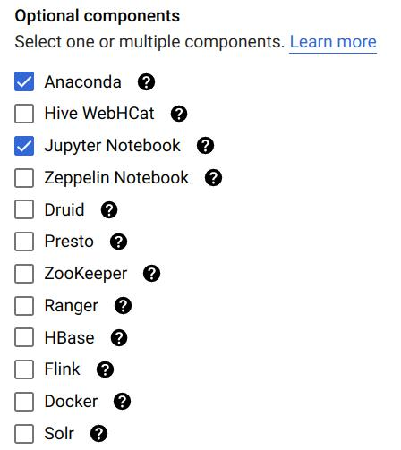
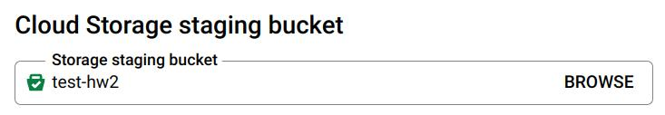
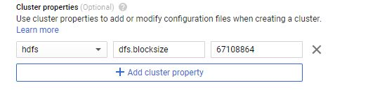
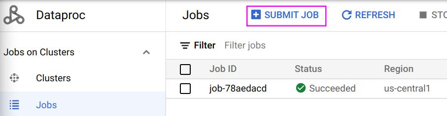
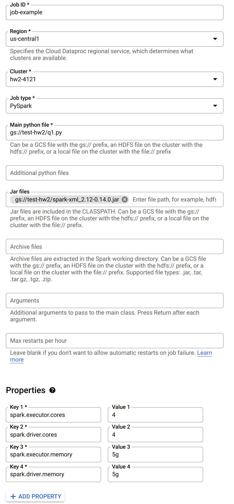

# Homework 3: A Tour of Apache Spark

Gain a hands-on understanding of Google Cloud Dataproc, Apache Spark, Spark SQL, and Spark Streaming over HDFS.

Released: **March 26, 2026**  
Due: **April 14, 2026**

## Overview

First introduced in [2010](https://www.usenix.org/legacy/event/hotcloud10/tech/full_papers/Zaharia.pdf), Apache Spark is one of the most popular modern cluster computing frameworks.

By leveraging its innovative distributed memory abstraction -- Resilient Distributed Datasets (RDDs) -- Apache Spark provides an effective solution to the I/O inefficiency of MapReduce, while retaining its scalability and fault tolerance.

In this assignment, you will deploy Spark and HDFS, write a Spark program generating a web graph from the entire Wikipedia, and write a PageRank program to analyze the web graph.

You will run those applications using Spark over HDFS in Google Cloud Dataproc.

As a well-maintained open-source framework, Apache Spark has well-written official documentation; you will find a lot of useful information by simply reading the official tutorials and documents.

When you encounter an issue regarding cluster deployment or writing Spark programs, you are encouraged to utilize online resources before posting questions on Ed.

## Learning Outcomes

After completing this programming assignment, you should be able to:

* Deploy and configure Apache Spark, HDFS in Google Cloud Dataproc.
* Write Spark applications using Python with Jupyter Notebook and launch them in the cluster.
* Describe how Apache Spark, Spark SQL, Spark Streaming, and HDFS work and interact with each other.

---

## Step-by-Step Environment Setup

### Step 1: Redeem Your GCP Credits

Make sure you have followed the [instructions](http://www.cs.columbia.edu/crf/cloud-cs/) provided by CRF to redeem your credits in Google Cloud.

### Step 2: Set Up Your GCP Project

1. Go to the [Google Cloud Console](https://console.cloud.google.com).
2. Create a new project or use the existing course project `csee4121-s26`.
3. Make sure billing is enabled on the project.

### Step 3: Enable the Dataproc API

1. Go to the [Dataproc console](https://console.cloud.google.com/dataproc).
2. Click on **Enable API** to enable Google Cloud Dataproc.
3. __Note__: you can pin Dataproc on your navigation menu for quick access.

### Step 4: Create a Cloud Storage Bucket

You need a GCS bucket to store your notebook backups and Spark output files. This protects your work in case your cluster goes down.

1. Go to [Cloud Storage](https://console.cloud.google.com/storage) in the GCP Console.
2. Click **Create Bucket**.
3. Choose a **globally unique** name — we recommend using your project ID as a prefix, e.g., `csee4121-s26-<your-uni>-hw2`.
4. Choose the same region you plan to use for your cluster (e.g., `us-east1`).
5. Leave all other settings as defaults and click **Create**.

> **Important:** GCS bucket names must be globally unique across **all** of Google Cloud. If a name is already taken by anyone, you will get a `409 Conflict` error. Always prefix with your project ID or UNI to avoid this.

> **Note:** You can verify your bucket is accessible at any time by running this command (in a terminal or notebook cell):
> ```bash
> gsutil ls gs://<your-bucket-name>/
> ```
> If you see `AccessDeniedException: 403`, the bucket does not exist in your project or the name is wrong.

### Step 5: Create Your Dataproc Cluster

Click on **Create cluster** in the [Dataproc console](https://console.cloud.google.com/dataproc) and select **Create cluster on Compute Engine**. We will start with a **Single Node** cluster for debugging.

| Setting | Recommended Value |
|---------|-------------------|
| **Cluster name** | `hw2-spark-cluster` (or any name) |
| **Region** | `us-east1` (must match your bucket's region) |
| **Cluster mode** | Single Node (for debugging; switch to Standard with 2 workers for Questions 3-8) |
| **Machine type** | `n4-standard-4` (4 vCPUs, 16 GB RAM) |
| **Image version** | `2.1-debian11` (Spark 3.3.x) |



#### Enable Jupyter Notebook

1. Scroll down to **Component gateway** and select **Enable access to the web interfaces of default and selected optional components on the cluster**.
2. Click on **Advanced options**.
3. Under **Optional components**, click **Select component**.
4. Choose **Jupyter Notebook** (Anaconda is pre-installed with miniconda in image 2.1; see [this](https://cloud.google.com/dataproc/docs/concepts/versioning/dataproc-release-2.1) for details).
5. Click **Select** to save.




Refer to [this doc](https://cloud.google.com/dataproc/docs/tutorials/jupyter-notebook) for more details.

#### Attach Your Cloud Storage Staging Bucket

1. In the **Advanced options** section, go to **Cloud Storage staging bucket**.
2. Click **Browse** and select the bucket you created in Step 4.



> **Note:** This step is technically optional but **highly recommended**. Dataproc will automatically save your notebooks to the linked bucket, protecting your work from cluster failures.

#### Cluster Properties

Components like Spark and Hadoop have many configurations that users can tune. You can change the default values when creating the cluster under **Cluster properties** in the Advanced Options section. You will need to edit cluster properties for some questions, but you can leave it alone to get started.



Refer to [this doc](https://cloud.google.com/dataproc/docs/concepts/configuring-clusters/cluster-properties) for more details.

### Step 6: Copy Data to HDFS

Once the cluster is created, go to **Cluster details** → **VM Instances** tab → click **SSH** on your master node.

Run the following commands to copy files into HDFS:

```bash
hdfs dfs -cp gs://csee4121-s26-data/wiki-small.xml /
hdfs dfs -cp gs://csee4121-s26-data/wiki-test.xml /
hdfs dfs -cp gs://csee4121-s26-data/wiki-whole.xml /
```

> **Note:** The files might take a while to transfer. In the meantime, [here](https://data-flair.training/blogs/top-hadoop-hdfs-commands-tutorial/) is a tutorial for HDFS commands.

Verify the files are in HDFS:

```bash
hdfs dfs -ls /
```

### Step 7: Install the spark-xml JAR

You need the `spark-xml` library to parse XML files. Run this command on your VM (run on **all** VMs if you have multiple nodes):

```bash
sudo hdfs dfs -get gs://csee4121-s26-data/spark-xml_2.12-0.16.0.jar /usr/lib/spark/jars/
```

### Step 8: Open Jupyter Notebook

1. Go to **Cluster details** → **Web Interfaces** tab.
2. Click the **Jupyter** link to open the Jupyter Notebook interface.
3. If the link doesn't work, try changing `https` to `http` in the URL.
4. **Important**: In the Jupyter file browser, double-click the **`GCS`** folder. You cannot create files in the root directory because it is read-only.
5. Create a new **PySpark** notebook inside the `GCS` folder, or upload `prog_hw2_starter.ipynb` from the repository.

> **Important:** The notebook kernel should be **PySpark**, not Python 3. This ensures Spark is available in your session.

---

## Data Setup

Before starting the tasks, you must copy the Wikipedia datasets from the shared class bucket to your cluster's internal storage (HDFS). 

Open a terminal on your Dataproc **master node** (or use the SSH button in the Google Cloud Console) and run the following commands:

```bash
# Copy the small debugging file
hdfs dfs -cp gs://csee4121-s26-data/wiki-small.xml /

# Copy the medium test file (for Questions 2-4)
hdfs dfs -cp gs://csee4121-s26-data/wiki-test.xml /

# Copy the large dataset (for Questions 5-8)
hdfs dfs -cp gs://csee4121-s26-data/wiki-whole.xml /
```

You can verify the files are successfully copied by running:
```bash
hdfs dfs -ls /
```

---

## Task 1: Getting Started (6 Points)

In this task, we provide you a big Wikipedia database in XML format. It can be found at `/wiki-whole.xml` in your HDFS.

This input file is very big (~1 GB) and you have to use a distributed file system like HDFS to handle it. We have also provided a smaller file `/wiki-small.xml` for debugging purposes.

The XML files are structured as follows:

```xml
<mediawiki>
    <siteinfo>
        ...
    </siteinfo>
    <page>
        <title>Title A</title>
        <revision>
            <text>Some text</text>
        </revision>
    </page>
    <page>
        ...
    </page>
    ...
</mediawiki>
```

To get a sense of how a Wiki page transfers to an XML file, take a look at the following examples:

* [Apple (orig)](https://en.wikipedia.org/wiki/Apple)
* [Apple (xml)](https://en.wikipedia.org/wiki/Special:Export/Apple)

### Task 1 Code

In your Jupyter notebook (PySpark kernel), create and run the following cells:

**Cell 1 — Initialize Spark:**
```python
from pyspark.sql import SparkSession
spark = SparkSession.builder.getOrCreate()
```

**Cell 2 — Read the XML file:**
```python
df = spark.read.format('xml').options(rowTag='page').load('hdfs:/wiki-small.xml')
```

**Cell 3 — Print the schema:**
```python
df.printSchema()
```

If you are having trouble debugging your code, try adding the following at the top of your notebook:

```python
import os
os.environ['PYSPARK_SUBMIT_ARGS'] = '--packages com.databricks:spark-xml_2.12:0.14.0 pyspark-shell'
```

**Question 1.** (4 points) What is the default block size on HDFS? What is the default replication factor of HDFS on Dataproc?

#### Task 1 Output

Copy the outputted schema to a **separate txt file** named `schema.txt`. (6 points)

### Submitting a Job

Once you are done debugging in Jupyter Notebook, you can download it as a Python (`.py`) file and submit it as a job to run on the cluster:



The following is an example job:



Notice you can specify a Python file to run from Google Cloud Storage. Also, when you need to read the XML files, make sure you have included the `.jar` file. You can also specify the number of cores and memory for driver and executor here.

Refer to [this doc](https://cloud.google.com/dataproc/docs/guides/submit-job) for details on submitting jobs.

---

## Task 2: Webgraph on Internal Links (38 Points)

Write a Spark program which takes the XML file as input and generates a **tab-separated CSV file** describing the webgraph of internal Wikipedia links. The output should look like:

```csv
article1	article0
article1	article2
article1	article3
article2	article3
article2	article0
...
```

### Link Extraction Rules

For each `<page>` element, the article on the left column corresponds to the string between `<title>` and `</title>`, while the article on the right column are those surrounded by a pair of double brackets `[[ ]]` in the `<text>` field, with the following requirements:

1. All the letters should be converted to **lowercase**.
2. If the internal link contains a `:`, you should **ignore the entire link** unless it starts with `Category:`.
3. **Ignore** links that contain a `#`.
4. If multiple links appear in the brackets, take the **first one**; e.g., take `A` in `[[A|B]]`.

If the remaining string becomes empty after filtering, ignore it. The two columns in the output file should be separated by a **Tab** (`\t`).

**Hint:** It is recommended to use UDF + regular expression to extract links from the documents. Also, try to use the built-in Spark functions to sort your results.

### Task 2 Code

**Cell 1 — Define the link extraction function:**
```python
import re

def func1(x):
    text1 = x.revision.text._VALUE
    if text1 is not None:
        text1 = text1.lower()
        lst = re.findall(r'\[\[([^\[\]]*)\]\]', text1)
        l1 = []
        newList = []
        for i in lst:
            if '#' in i or i == ' ':
                continue
            elif (':' in i) and ~(i.startswith('Category:')):
                continue
            elif '|' in i:
                k = i.split('|')
                if k[0] != ' ':
                    l1.append(k[0])
            else:
                l1.append(i)
        for i in l1:
            newList.append((x.title.lower(), i))
    else:
        return []
    return newList
```

**Cell 2 — Create the webgraph RDD:**
```python
rdd_t = df.rdd.flatMap(lambda x: func1(x))
```

**Cell 3 — Convert to DataFrame and preview:**
```python
df_cleaned = spark.createDataFrame(rdd_t, schema=["title", "link"])
df_cleaned.printSchema()
df_cleaned.show(truncate=False)
```

**Cell 4 — Sort the results:**
```python
df_cleaned = df_cleaned.orderBy('title', 'link')
df_cleaned.show()
```

**Cell 5 — Write output to GCS:**
```python
df_cleaned.coalesce(1).write.mode("overwrite").csv(
    "gs://<your-bucket-name>/task2-output",
    header=True,
    sep='\t'
)
```

> **Note:** Spark writes output as a **directory** containing a `part-00000-XXXXX.csv` file and a `_SUCCESS` marker. Since you use `.coalesce(1)`, there will be only one output part file — that is your actual CSV.

> **Caution:** Make sure the bucket name in the write path matches a bucket **in your project**. If you use a bucket that doesn't exist or belongs to another project, you will get `AccessDeniedException: 403`. Verify with `!gsutil ls gs://<your-bucket-name>/`.

### Configuration & Questions

**You should use the default configuration of Spark and HDFS, unless we specify a different one.**

Set the **Spark driver memory** to 1GB and the **Spark executor memory** to 5GB to answer Questions 2-4.

**Question 2.** (2 points) Use `wiki-test.xml` as input and run the program locally on a **Single Node** cluster using 4 cores. Include your screenshot of the dataproc job. What is the completion time of the task?

**Question 3.** (2 points) Use `wiki-test.xml` as input and run the program under HDFS inside a **3 node cluster** (2 worker nodes). Include your screenshot of the dataproc job. Is the performance getting better or worse in terms of completion time? Briefly explain.

**Question 4.** (2 points) For this question, change the default block size in HDFS to be **64MB** and repeat Question 3. Include your screenshot of the dataproc job. Record the run time. Is the performance getting better or worse in terms of completion time? Briefly explain.

Set the **Spark driver memory** to 5GB and the **Spark executor memory** to 5GB to answer Questions 5-7. Use this configuration across the entire assignment whenever you generate a web graph from `wiki-whole.xml`.

**Question 5.** (2 points) Use `wiki-whole.xml` as input and run the program under HDFS inside the Spark cluster you deployed. Record the completion time. Now, kill one of the worker nodes immediately. You could kill one of the worker nodes by going to the **VM Instances** tab on the Cluster details page and clicking on the name of one of the workers. Then click the STOP button. Record the completion time. Does the job still finish? Do you observe any difference in the completion time? Briefly explain your observations. Include your screenshot of the dataproc jobs.


**Question 6.** (2 points) Only for this question, change the **replication factor** of `wiki-whole.xml` to 1 and repeat Question 5 without killing one of the worker nodes. Include your screenshot of the dataproc job. Do you observe any difference in the completion time? Briefly explain.

**Question 7.** (2 points) Only for this question, change the **default block size** in HDFS to be **64MB** and repeat Question 5 without killing one of the worker nodes. Record the run time. Include your screenshot of the dataproc job. Is the performance getting better or worse in terms of completion time? Briefly explain.

#### Task 2 Output

Besides answering these questions, you also need to submit the code and output. You need to use `wiki-small.xml` as the input file, and sort both output columns in ascending order and save the **complete** output into a CSV file and name it `task2.csv`. Separate the columns with a `Tab`. Save the column names / headers as the first row of the CSV file. (38 points)

---

## Task 3: Spark PageRank (38 Points)

In this task, you are going to implement the PageRank algorithm, which Google uses to rank websites in Google Search. We will use it to calculate the rank of the articles in Wikipedia. The algorithm can be summarized as follows:

1. Each article has an initial rank of **1**.
2. On each iteration, the contribution of an article A to its neighbor B is calculated as `its rank / # of neighbors`.
3. Update the rank of article B to be `0.15 + 0.85 * contribution`.
4. Go to the next iteration.

The output should be a CSV file containing two columns: the first column is the article and the other column describes its rank. Separate the columns with a `Tab`.

Set the Spark driver memory to 5GB and the Spark executor memory to 5GB whenever you run your PageRank program. Write a script to first run Task 2, and then run Task 3 using the CSV output generated by Task 2. Always use **10 iterations** for the PageRank program. When running Task 2, use `wiki-whole.xml` as input.

### Task 3 Code

> **Important:** You must import `add` from the `operator` module. Without this import, you will get `NameError: name 'add' is not defined`.

**Cell 1 — Import and read Task 2 output:**
```python
from operator import add

df = spark.read.format("csv") \
    .option("header", "False") \
    .option("delimiter", "\t") \
    .load("gs://<your-bucket-name>/task2-output") \
    .withColumnRenamed('_c1', 'target') \
    .withColumnRenamed('_c0', 'source')
```

> **Caution:** The read path here must match the **exact path** you wrote to in Task 2. If you wrote to `gs://<your-bucket>/task2-output`, read from the same path. A mismatched path will give you `AnalysisException: Path does not exist`.

**Cell 2 — Build the links and initial ranks:**
```python
links = df.distinct().rdd.groupByKey().cache()
ranks = links.map(lambda url_neighbors: (url_neighbors[0], 1.0))
```

**Cell 3 — Define the contributions function:**
```python
def computeContribs(urls, rank):
    """Calculates URL contributions to the rank of other URLs."""
    num_urls = len(urls)
    for url in urls:
        yield (url, rank / num_urls)
```

**Cell 4 — Run 10 iterations of PageRank:**
```python
for i in range(10):
    contribs = links.join(ranks).flatMap(lambda url_urls_rank: computeContribs(
        url_urls_rank[1][0], url_urls_rank[1][1]
    ))
    ranks = contribs.reduceByKey(add).mapValues(lambda rank: rank * 0.85 + 0.15)
```

**Cell 5 — View and save the top 10 results:**
```python
r = spark.createDataFrame(ranks)
sol = r.sort("_2", ascending=False).limit(10)
sol.show()
```

**Cell 6 — Write output to GCS:**
```python
sol.repartition(1).write.mode("overwrite").csv(
    "gs://<your-bucket-name>/task3-output",
    header=False,
    sep='\t'
)
```

### Questions

**Question 8.** (2 points) Use your output from Task 2 with `wiki-whole.xml` as input, run Task 3 using a 3 node cluster (2 worker nodes). Include your screenshot of the dataproc job. What is the completion time of the task?

#### Task 3 Output

To submit the code part of the assignment you will need to use `wiki-small.xml` as the input file for Task 2 and then run your code for Task 3. Sort the output by the PageRank in **descending** order, i.e., the output should contain the title and PageRank of the articles with the top 10 scores. Save the first 10 rows as a `.csv` file, separating the columns with a Tab (i.e., `sep='\t'`). Name it `task3.csv`. Do **NOT** save the column names / headers as part of the CSV file. (38 points)

---

## Downloading Your Output Files

After your Spark jobs complete, the output CSV files are in your GCS bucket. Spark writes output as directories, so you need to download the actual `part-00000-*.csv` file inside.

### Option 1: From the Jupyter Notebook
```python
# List output files
!gsutil ls gs://<your-bucket-name>/task2-output/
!gsutil ls gs://<your-bucket-name>/task3-output/

# Preview contents
!gsutil cat gs://<your-bucket-name>/task2-output/part-00000*.csv | head -20
```

### Option 2: From the GCP Console
1. Go to [Cloud Storage](https://console.cloud.google.com/storage) → your bucket.
2. Navigate into `task2-output/` or `task3-output/`.
3. Click on the `part-00000-*.csv` file and download it.

### Option 3: From your local machine (with gsutil installed)
```bash
gsutil cp 'gs://<your-bucket-name>/task2-output/part-00000*.csv' ./task2.csv
gsutil cp 'gs://<your-bucket-name>/task3-output/part-00000*.csv' ./task3.csv
```

---

## Troubleshooting

| Issue | Cause | Fix |
|-------|-------|-----|
| `AccessDeniedException: 403` when writing to GCS | Bucket doesn't exist in your project or wrong name | Run `!gsutil ls -p <your-project-id>` to list your buckets. Use one that exists. |
| `NameError: name 'add' is not defined` | Missing import in PageRank code | Add `from operator import add` before the PageRank loop |
| `AnalysisException: Path does not exist` | Task 3 reading from a path Task 2 didn't write to | Make sure the read path in Task 3 matches the exact write path from Task 2 |
| `Py4JJavaError` when reading XML | spark-xml JAR not installed | Run: `sudo hdfs dfs -get gs://csee4121-s26-data/spark-xml_2.12-0.16.0.jar /usr/lib/spark/jars/` |
| Jupyter link not working | HTTPS issue | Change `https` to `http` in the URL |

---

## Best Practices

* **Delete the cluster** after you are done for a coding session. Do not leave it on overnight. Otherwise, you will burn through your credits very quickly.
* **Start with small files** and use a one node setup to debug your code. Then try to run your code on bigger files and a three-node setup.
* It is recommended to use **Jupyter Notebook** to debug your code. Make sure you have shutdown all of your Jupyter notebooks before you submit your job using the web interface.

### 1. Written Questions 1-8

This will be a Gradescope form. You will input your answers to the written questions 1-8.
Please keep your answers succinct. We may deduct points for excessively verbose answers. For theoretical questions, a maximum of 1–2 lines per answer is expected.

### 2. Code and Outputs (zip file)

Name the file `<UNI-1>_<UNI-2>.zip`.

The Spark projects from Task 2-3 should go under folder names `task2`, `task3`, accordingly.

Inside each folder, in addition to the Jupyter notebook and Python files, there should be an additional file named `config` which describes configurations or additional steps you did to run the three tasks mentioned below.

You also need to provide a `config` file which describes configurations or additional steps you did to run the **following tasks on a single Spark node:**

1. Use the program in Task 2 to take `wiki-small.xml` as input to generate the graph.
2. Use the program in Task 3 to take the graph you just generated and output a rank list of the articles in the dataset.

Try to be clear about the instructions to run these steps. The purpose of doing this is to check if your program does what we mentioned in the spec. Do not worry whether your program has the lowest completion time.

In addition to the code, you will need to submit the following output files for each of the tasks:

1. `schema.txt`
2. `task2.csv` (complete webgraph, with header)
3. `task3.csv` (top 10 PageRank results, no header)

```
UNI-1_UNI-2_assignment2.zip
├── task1
│   └── schema.txt
├── task2
│   ├── task2.csv
│   ├── task2.py
│   ├── task2.ipynb
│   └── task2config.txt
└── task3
    ├── task3.csv
    ├── task3.py
    ├── task3.ipynb
    └── task3config.txt
```
